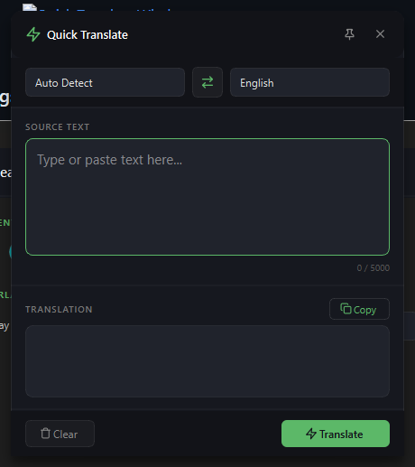
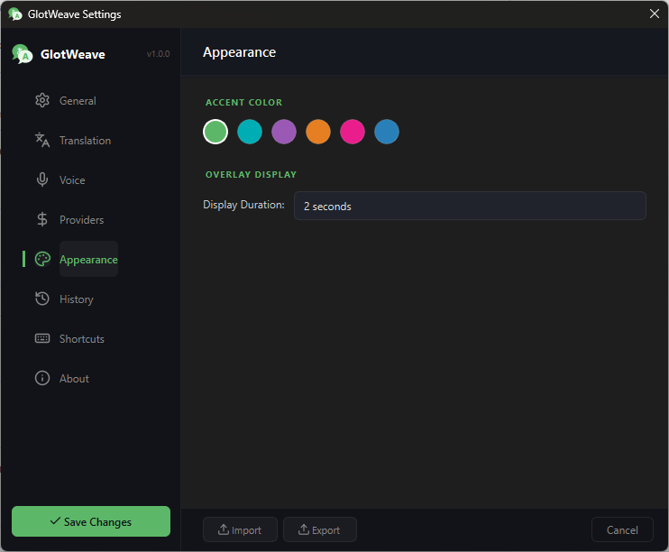
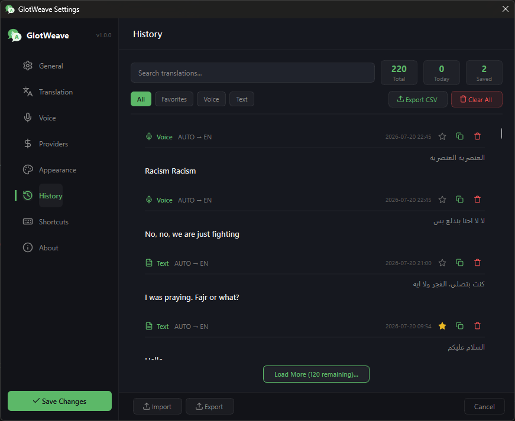
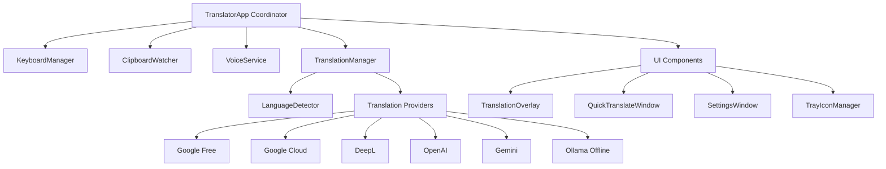

# GlotWeave

> A real-time, hotkey-driven desktop translation assistant and voice input tool for Windows.

---

[](LICENSE)
[](app/config.py)
[](https://www.python.org/)
[](https://www.microsoft.com/)
[](https://pypi.org/project/PySide6/)

---

## Hero Section

**GlotWeave** is a lightweight, system-wide translation assistant built for Windows. It provides instant floating HUD overlays, in-place Grammarly-style text replacement across any desktop app, voice-to-text translation via microphone input, and automated clipboard monitoring.

### Why GlotWeave?
Traditional translation workflow requires copying text, switching to a web browser, opening a translation service, pasting text, copying the result, and returning to the original application. GlotWeave eliminates this context switching entirely.

### Key Highlights
- **Zero-friction workflow**: Highlight text and hit `Ctrl+Shift+F9` to translate and overwrite selected text directly inside your editor or input field.
- **Hands-free translation**: Speak into your microphone via `Ctrl+Shift+F10` to record, transcribe, and translate your speech on the fly.
- **Hybrid backend architecture**: Choose between free endpoints, high-accuracy cloud APIs (DeepL, OpenAI, Gemini, Google Cloud), or fully offline local LLMs (Ollama).

---

## Screenshots


*Quick Translate floating search window (`Ctrl+Shift+Q`)*


*Settings panel with provider configuration and custom theme accents*


*Translation history view with favorites bookmarking and CSV export*

---

## Features

### Direct In-Place Translation
- **Selected Text Replacement**: Simulates inline copy-translate-paste to replace highlighted text directly in any application (`Ctrl+Shift+F9`).
- **Live Typing Buffer**: Translates completed sentences automatically when double-spacing after text input.
- **Layout Switch Trigger**: Re-translates input automatically upon switching keyboard layouts (`Alt+Shift` / `Win+Space`).

### Voice Speech-to-Text Translation
- **Microphone Capture**: Records speech with automatic ambient noise adjustment and silence detection.
- **Continuous Mode**: Optional hands-free continuous recording with configurable silence threshold timeouts.
- **Auto Language Identification**: Detects spoken language from candidate audio streams.

### Multi-Provider Translation Engine
- **Google Translate (Free)**: GTX web endpoint with `googletrans` fallback.
- **Google Cloud Translation**: Official Cloud Translation v2 API integration.
- **DeepL API**: DeepL Free and Pro API v2 engine integration.
- **OpenAI API**: High-fidelity translation powered by `gpt-4o-mini`.
- **Gemini API**: Ultra-fast translation using `gemini-1.5-flash`.
- **Ollama (Local LLM)**: Offline, zero-telemetry translation using local models (e.g. `llama3`).

### Desktop & UI Integration
- **System Tray Agent**: Runs minimized in the system tray with pause/resume controls.
- **HUD Translation Overlay**: Non-intrusive, frameless floating overlay with auto-fade duration and opacity settings.
- **History & CSV Export**: Automatically logs up to 1,000 translation records with full-text search, favorite tagging, and CSV file export.
- **Custom Accent Themes**: Choice of curated color accents (`Green`, `Cyan`, `Purple`, `Orange`, `Pink`, `Blue`).

---

## Tech Stack

| Category | Technology |
|---|---|
| **Language** | Python 3.10+ |
| **GUI Framework** | PySide6 (Qt for Python 6.5+) |
| **Hotkey & System Hook** | `keyboard`, `pyperclip`, `ctypes` (Win32 API) |
| **Speech Processing** | `SpeechRecognition`, `sounddevice`, `scipy`, `numpy` |
| **HTTP & API Client** | `requests` |
| **Image & OCR Prep** | `Pillow`, `pytesseract` |
| **Packaging & Installer** | PyInstaller 5.13+, Inno Setup 6 |

---

## Project Structure

```text
GlotWeave/
├── app/
│   ├── config.py             # Application metadata, language lists, and default settings
│   └── main.py               # Main application entry point and central coordinator
├── core/
│   ├── clipboard.py          # Clipboard helper and watcher service
│   ├── history_manager.py    # Dataclass model and JSON/CSV history storage manager
│   ├── keyboard.py           # Global hotkey hooks and live typing buffer logic
│   ├── settings.py           # Application settings dataclass and Windows registry autostart
│   └── translator.py         # Abstract TranslationProvider interface and TranslationManager
├── services/
│   ├── cloud_providers.py    # Google Cloud v2, DeepL, OpenAI, and Gemini API providers
│   ├── google_translate.py   # Free Google Translate provider with library fallback
│   ├── language_detector.py # Fast regex heuristic and online language detection
│   ├── ollama_translate.py   # Local Ollama offline LLM provider integration
│   ├── update_checker.py    # Background GitHub release version checker
│   └── voice_service.py     # Asynchronous speech recognition service and microphone patching
├── ui/
│   ├── history_window.py     # History log management tab and search interface
│   ├── icons.py              # Dynamic SVG renderer and icon palette generator
│   ├── overlay.py            # Frameless HUD overlay notification window
│   ├── quick_translate.py    # Floating Quick Translate widget window
│   ├── settings_window.py   # Settings configuration GUI tab view
│   └── tray.py               # System tray icon and context menu manager
├── scripts/
│   ├── build_installer.py   # Automated PyInstaller and Inno Setup build pipeline
│   └── generate_icon.py     # SVG to PNG/ICO asset converter script
├── assets/                   # SVG, PNG, and ICO icon assets
├── installer.iss             # Inno Setup compiler configuration file
├── instant_translator.spec   # PyInstaller spec configuration file
└── requirements.txt          # Python package dependency manifest
```

---

## Architecture

GlotWeave follows a decoupled, event-driven coordinator architecture centered around Qt's Signal/Slot mechanism:



### Core Architecture Principles:
1. **Central Coordinator (`TranslatorApp`)**: Manages life cycle, binds user events from hotkeys or clipboard hooks, and dispatches background translation worker threads.
2. **Provider Interface (`TranslationProvider`)**: Unified abstract class interface allowing dynamic routing and seamless fallback between cloud APIs and local LLMs.
3. **Audio Capture Pipeline (`VoiceService`)**: Multi-threaded sound recorder utilizing `sounddevice` and `SpeechRecognition` with non-blocking signal emissions.
4. **Win32 Input Simulation**: Emulates keypress events (`ctypes.windll.user32`) to achieve smooth, artifact-free text highlighting, copying, and inline text replacement across third-party applications.

---

## Requirements

### Operating System
- **Windows 10 / 11** (64-bit required for PySide6 and Win32 hook APIs)

### Runtime Dependencies
- **Python 3.10+**
- System Microphone (for voice input capabilities)
- **Tesseract OCR Engine** *(Optional, required only for OCR features)*

### Build Prerequisites (Optional)
- **Inno Setup 6+** (Required only for building single-file setup executable installers)

---

## Installation

### Standard Setup (Recommended)
Download and execute `GlotWeave_Setup_v1.0.0.exe` from the latest release artifacts to install the pre-compiled binary.

### Development Environment Setup
To build or run from source, set up a local Python environment:

```bash
# Clone the repository
git clone https://github.com/z3i0/GlotWeave.git
cd GlotWeave

# Create and activate virtual environment
python -m venv .venv
.venv\Scripts\activate

# Install dependencies
pip install -r requirements.txt
```

---

## Configuration

Configuration values are stored in `%USERPROFILE%\.glotweave\settings.json`. They can be modified via the built-in Settings UI or updated in `settings.json`.

| Setting / Config Variable | Description | Required | Default Value |
|---|---|---|---|
| `provider` | Active translation provider (`google_free`, `deepl`, `openai`, `gemini`, `google_cloud`, `ollama`) | Yes | `google_free` |
| `api_key` | API authentication key for DeepL, OpenAI, Gemini, or Google Cloud | Dependent on provider | `""` |
| `source_lang` | Default source language code (`auto`, `en`, `ar`, etc.) | Yes | `auto` |
| `target_lang` | Default target language code (`en`, `ar`, `fr`, etc.) | Yes | `en` |
| `hotkey` | Global hotkey for in-place selected text translation | Yes | `ctrl+shift+f9` |
| `voice_hotkey` | Global hotkey for microphone speech recognition | Yes | `ctrl+shift+f10` |
| `quick_translate_hotkey` | Global hotkey to toggle Quick Translate popup | Yes | `ctrl+shift+q` |
| `ollama_url` | Base URL of local Ollama server | For Ollama provider | `http://localhost:11434` |
| `ollama_model` | Model name for Ollama local LLM | For Ollama provider | `llama3` |
| `deepl_url` | Base endpoint URL for DeepL API (Free/Pro) | For DeepL provider | `https://api-free.deepl.com` |
| `theme` | UI Theme mode | Yes | `dark` |
| `accent_color` | Accent color key (`green`, `cyan`, `purple`, `orange`, `pink`, `blue`) | Yes | `green` |

---

## Running

### Run Development Mode
Launch the application directly using Python:

```bash
python app/main.py
```

### Generate Assets & Icons
Regenerate icon resources and checkbox assets:

```bash
python scripts/generate_icon.py
```

### Build Standalone Executable & Windows Installer
Build the PyInstaller bundle and Inno Setup installer executable:

```bash
python scripts/build_installer.py
```

Output files will be generated under:
- PyInstaller Bundle: `dist/GlotWeave/`
- Windows Setup Executable: `installer_output/GlotWeave_Setup_v1.0.0.exe`

---

## Storage & Persistence

GlotWeave does not require an external database server. Data is persisted locally using structured JSON storage in the user home directory:

- **Settings**: `%USERPROFILE%\.glotweave\settings.json`
- **Translation History**: `%USERPROFILE%\.glotweave\history.json` *(Caps automatically at 1,000 entries)*
- **Application Logs**: `%USERPROFILE%\.glotweave\app.log`

---

## API & Provider Integrations

| Provider ID | Provider Name | Method / Protocol | Base Endpoint |
|---|---|---|---|
| `google_free` | Google Translate (Free) | HTTP GET / GTX API | `https://translate.googleapis.com/translate_a/single` |
| `google_cloud` | Google Cloud Translate v2 | HTTP POST | `https://translation.googleapis.com/language/translate/v2` |
| `deepl` | DeepL API v2 | HTTP POST | `https://api-free.deepl.com/v2/translate` |
| `openai` | OpenAI Chat Completions | HTTP POST (`gpt-4o-mini`) | `https://api.openai.com/v1/chat/completions` |
| `gemini` | Google Gemini API | HTTP POST (`gemini-1.5-flash`) | `https://generativelanguage.googleapis.com/v1beta` |
| `ollama` | Ollama Offline LLM | HTTP POST | `http://localhost:11434/api/generate` |

---

## Configuration Files

- [`app/config.py`](file:///d:/Workspace/Python/InstantTranslator/app/config.py): Contains global default configuration parameters, directory paths, language dictionary mapping, and supported provider lists.
- [`instant_translator.spec`](file:///d:/Workspace/Python/InstantTranslator/instant_translator.spec): PyInstaller spec bundling executable metadata, asset packaging, and hidden import hooks.
- [`installer.iss`](file:///d:/Workspace/Python/InstantTranslator/installer.iss): Inno Setup script for building the Windows installer wizard.
- [`pyrightconfig.json`](file:///d:/Workspace/Python/InstantTranslator/pyrightconfig.json): Python type-checking configuration.

---

## Usage

### In-Place Text Translation
1. Highlight any text in any document or web page.
2. Press `Ctrl+Shift+F9`.
3. GlotWeave captures the text, translates it, and pastes the translated text back into place.

### Voice Input Translation
1. Press `Ctrl+Shift+F10` (or click the microphone icon in System Tray).
2. Speak into your microphone.
3. Upon detecting silence, GlotWeave transcribes your audio and displays the translation overlay.

### Quick Translate Search Window
1. Press `Ctrl+Shift+Q`.
2. Type or paste text to translate dynamically.

---

## Roadmap

Planned enhancements based on codebase structure and upcoming features:

- [ ] Complete native OCR integration via `pytesseract` and region selection overlay.
- [ ] Add Text-to-Speech (TTS) audio playback capability for translated output.
- [ ] Expand global hotkey remapping UI validator.

---

## Contributing

Contributions are welcome! Please follow these guidelines:

1. Fork the repository.
2. Create a feature branch (`git checkout -b feature/amazing-feature`).
3. Ensure your code conforms to standard Python style guidelines (PEP 8).
4. Commit your changes (`git commit -m 'Add amazing feature'`).
5. Push to the branch (`git push origin feature/amazing-feature`).
6. Open a Pull Request.

---

## Security

If you discover a security vulnerability within GlotWeave, please refrain from opening a public issue. Instead, report security issues responsibly by contacting the maintainer directly via GitHub or email.

---

## License

This project is open-source software licensed under the [MIT License](LICENSE).

---

## Acknowledggements

- [PySide6](https://wiki.qt.io/Qt_for_Python) for the Qt GUI framework.
- [googletrans](https://github.com/ssut/py-googletrans) for Google translation capabilities.
- [SpeechRecognition](https://github.com/Uberi/speech_recognition) & [sounddevice](https://python-sounddevice.readthedocs.io/) for audio input processing.
